# Resume Builder

## Overview

**Resume Builder** is a dynamic web application that streamlines the process of creating, selecting, and managing resumes. The platform allows users to select templates, view resumes of selected candidates based on company and roles, and provides an admin panel for effective management of companies and resumes. 

## Features

### User Features:
- **Dynamic Resume Templates**: Users can select from various resume templates to create a professional resume.
- **Resume Viewing**: Users can browse resumes of selected candidates based on:
  - Company
  - Role
- **Interactive and Responsive Design**: Ensures a seamless user experience across all devices.

### Admin Features:
- **Admin Login**: Secure access for admins to manage the platform.
- **Company Management**: Admins can maintain a list of companies.
- **Resume Upload**: Admins can upload and associate selected resumes with specific companies and roles dynamically.


## Technologies Used

### Frontend:
- **React.js**: For building the user interface.

  
### Backend:
- **Node.js**: For handling server-side logic.
- **Express.js**: For building the RESTful API.
  
### Database:
- To dynamically manage users, companies, roles, and resumes database MongoDB is used.

## Installation and Setup

### Prerequisites:
- **Node.js** installed on your system.
- **npm** or **yarn** for managing dependencies.
- **setup env folder**


### Steps:
1. Clone the repository:
   ```bash
   https://github.com/naSim087/resume_builderr
2. ```bash
   cd frontend
3. ```bash
   npm install
4. ```bash
   npm start
2. ```bash
   cd backend
3. ```bash
   npm install
4. ```bash
   npm start


### Env Folder Structure (Visual Representation):
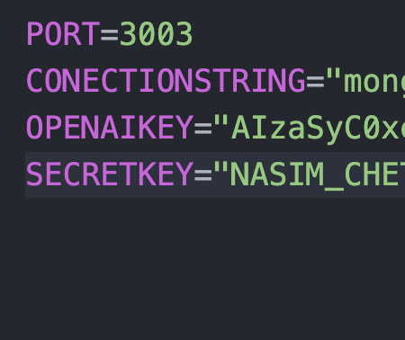

## Screenshots

### About Page (Dark Mode):
The **About Page** provides information about the project in an intuitive design.

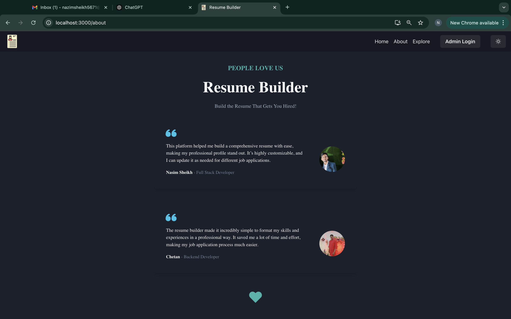

### About Page (Light Mode):
The **About Page** in light mode for enhanced readability.

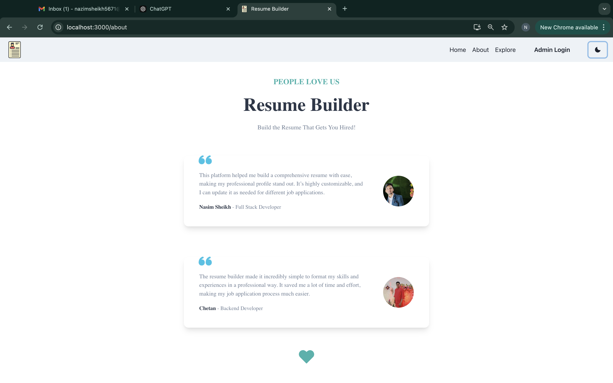

### Admin Dashboard:
The **Admin Dashboard** allows the admin to manage companies, roles, and resumes.

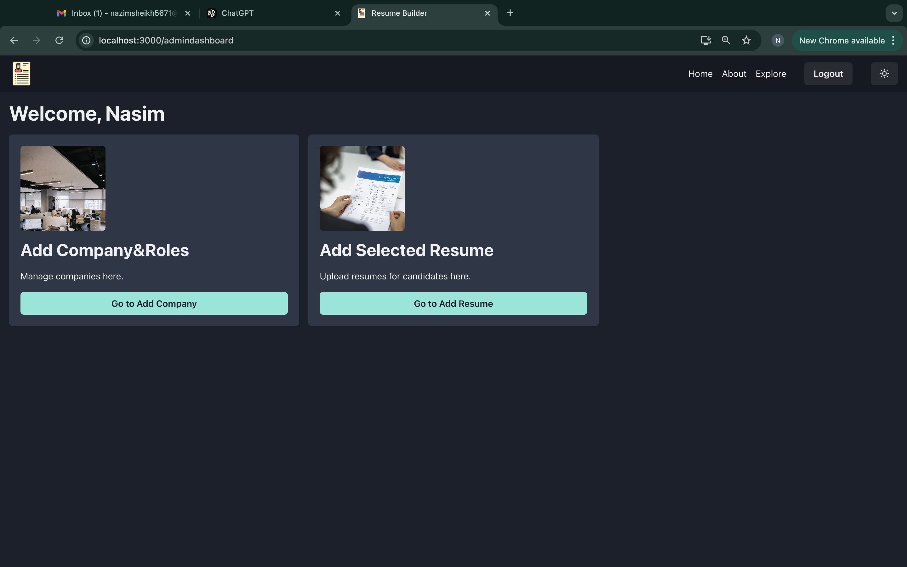

### Admin Adding Company Roles:
Admins can add and manage roles for a company.

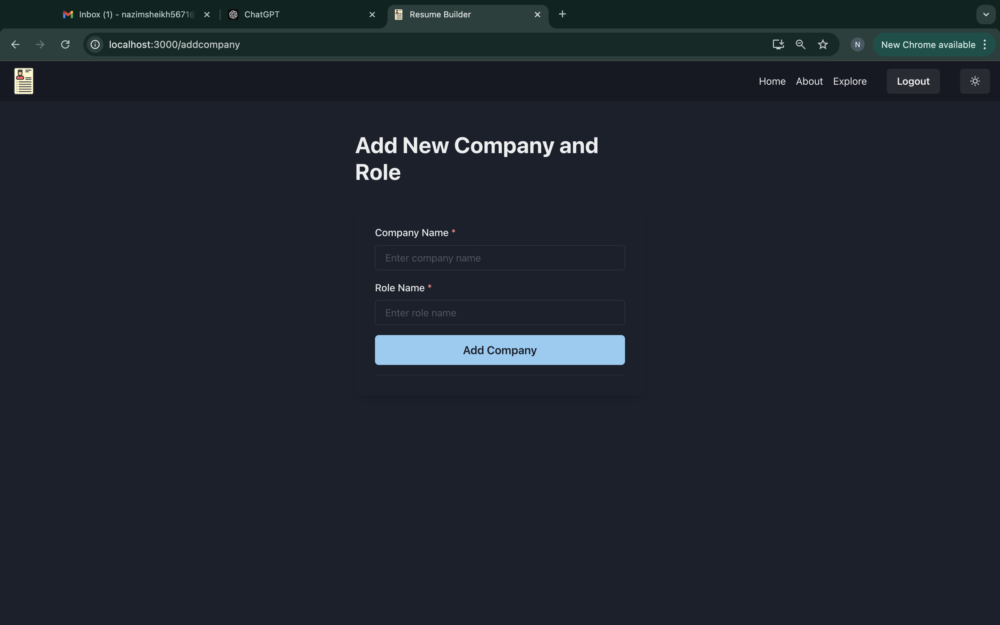

### Admin Adding Selected Resume:
Admins can upload and manage resumes selected for specific companies and roles.

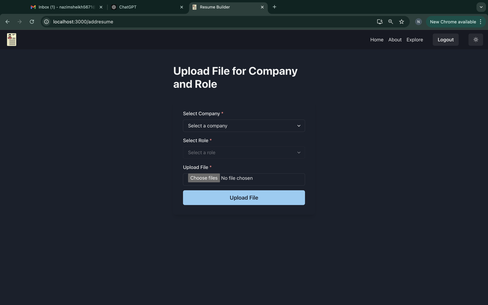

### Resume Based on Role:
View resumes filtered by selected company and role.

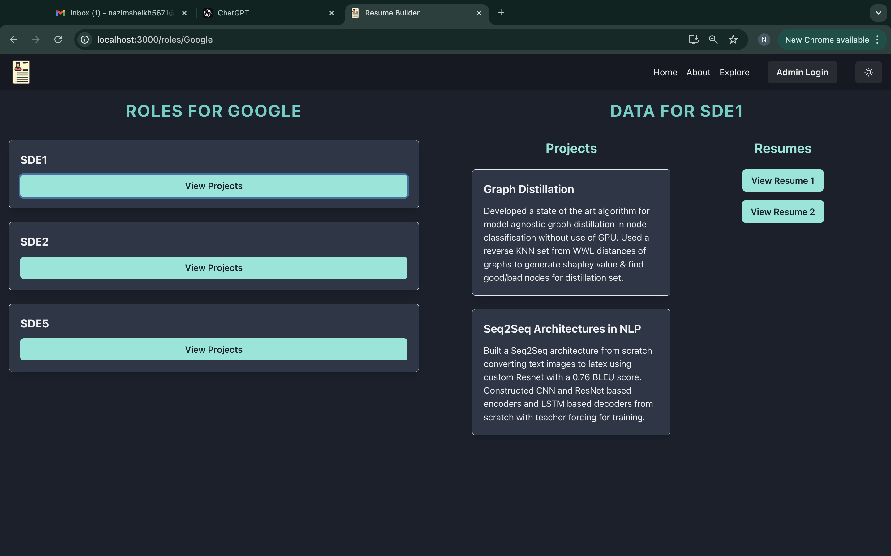

### Resume Checkout (Role Selection - 1):
Allows users to select roles for viewing relevant resumes.

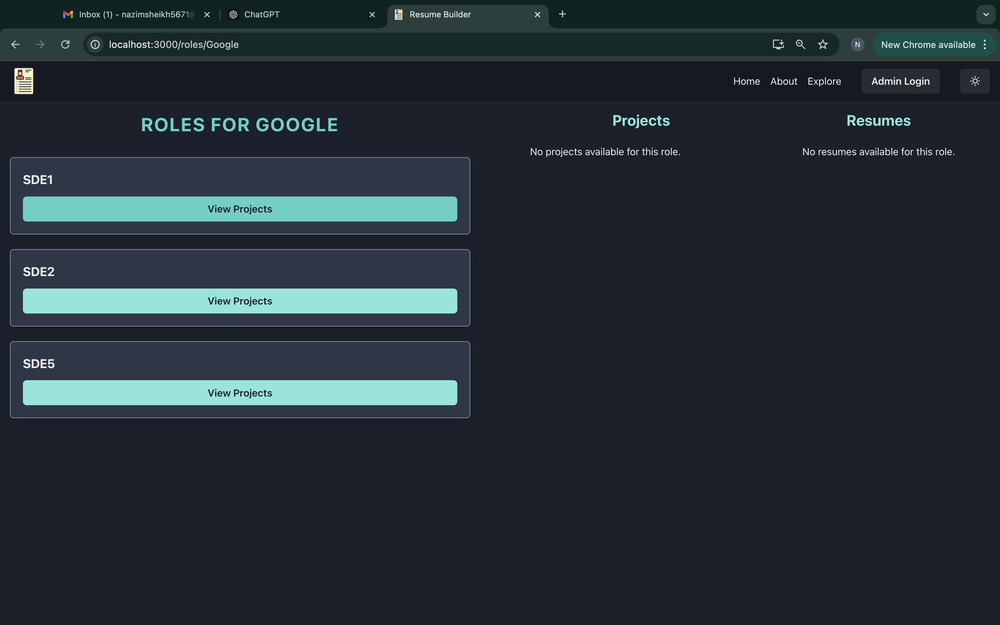

### Resume Checkout (Role Selection - 2):
A more detailed view of role selection for filtering resumes.

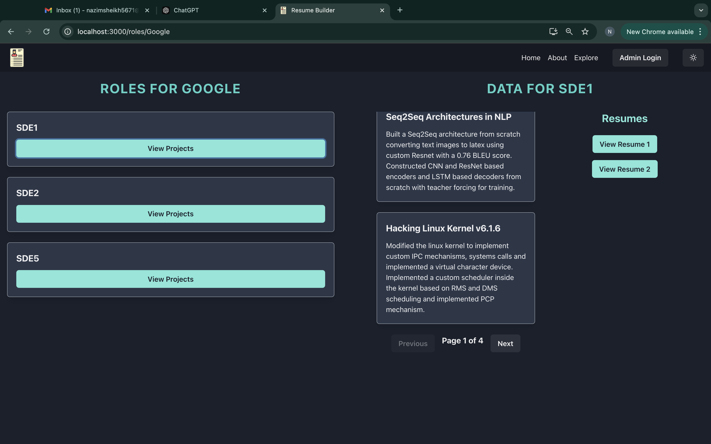

### Resume View:
Displays the detailed resume view.

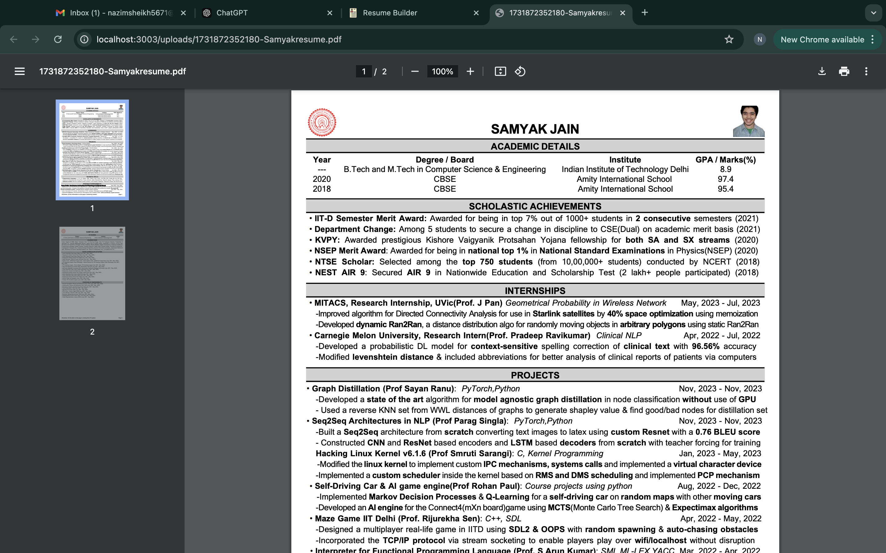

### Template Selection (Light Mode):
Users can browse and select from available resume templates.

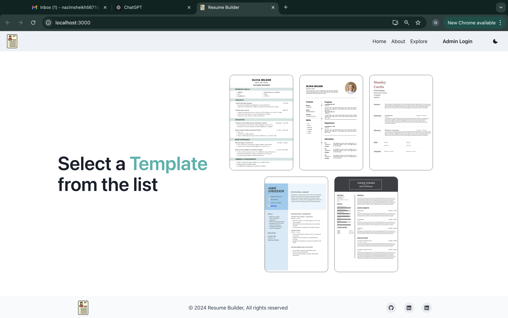

### Template Selection (Dark Mode):
The template selection page in dark mode for better UI adaptability.

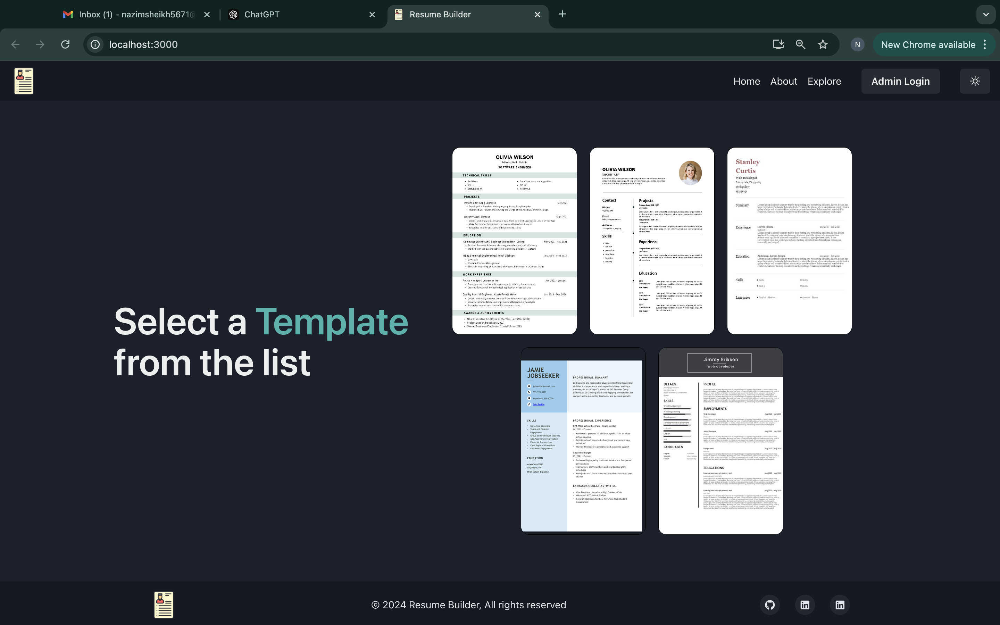

### Explore Page (Dark Mode):
An interactive explore page in dark mode.

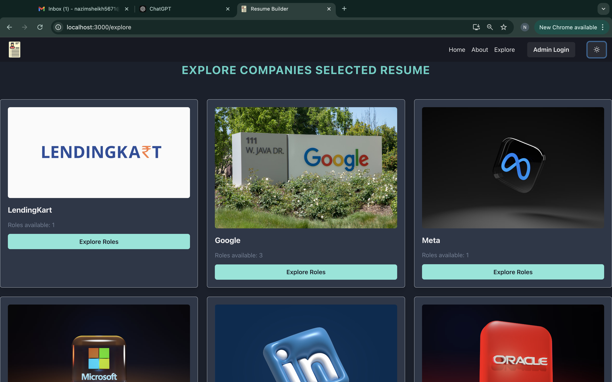

### Explore Page (Page 1):
A clean, user-friendly explore page.

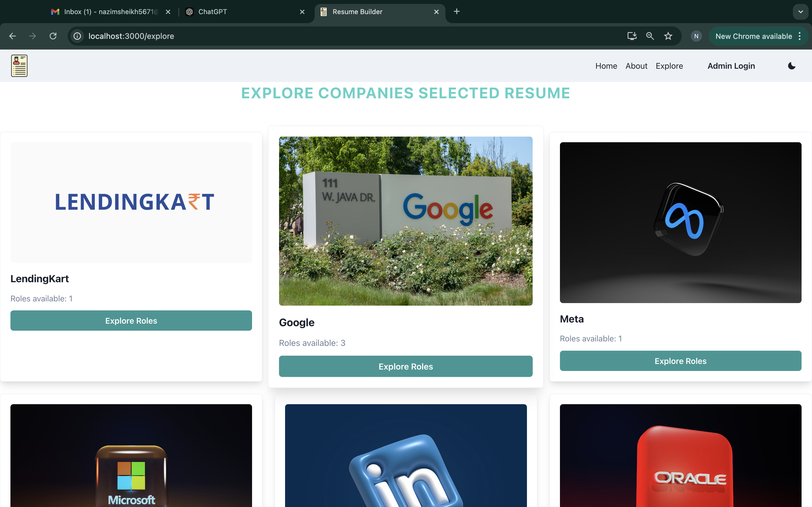

### Explore Page (Page 2):
Provides detailed insights into the explore feature.

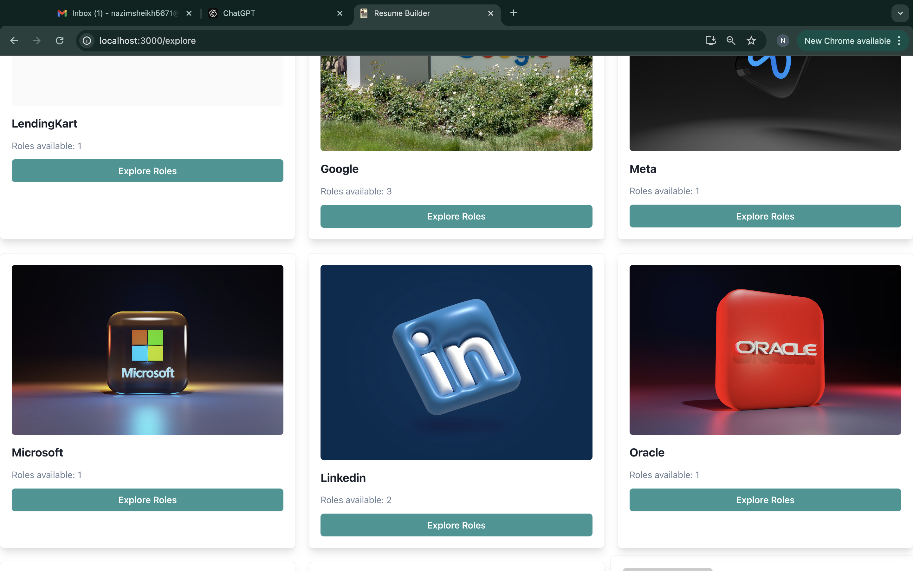

---

## Contributing

If you'd like to contribute to this project, feel free to fork the repository, create a new branch, and submit a pull request. Contributions are welcome!


